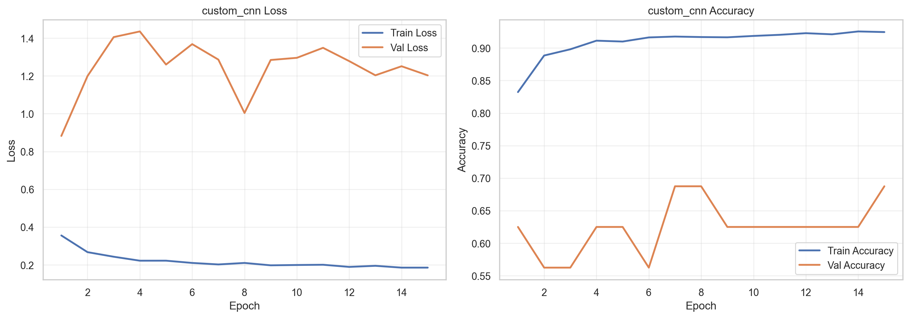
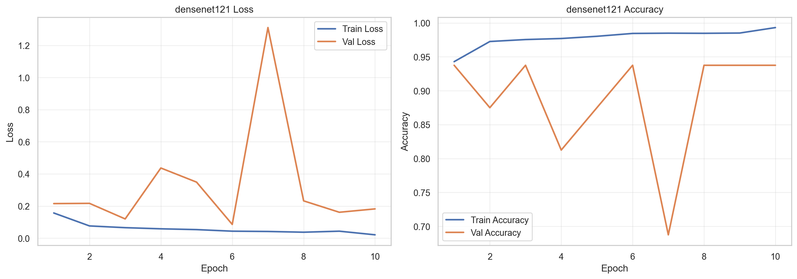
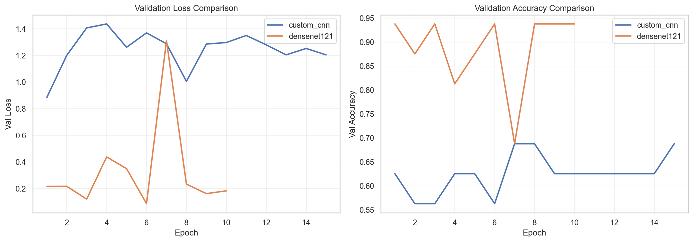
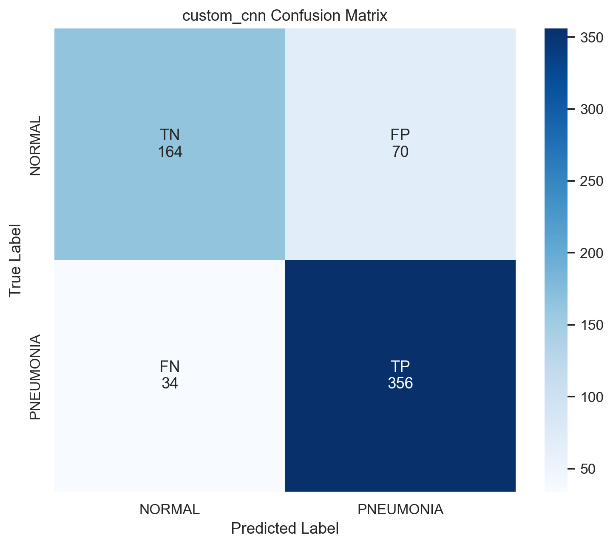
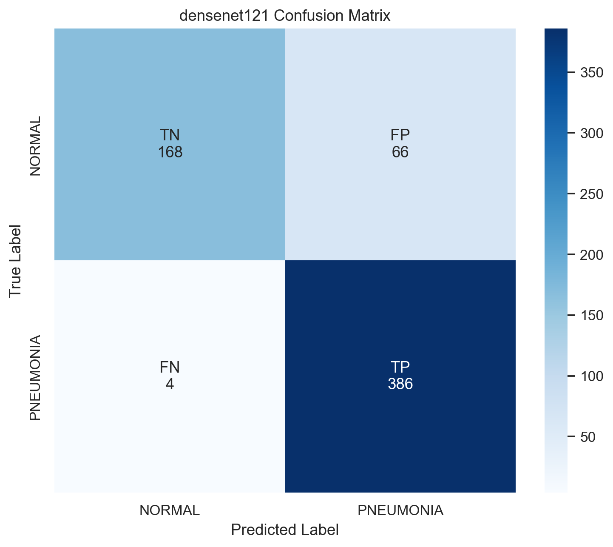

# CS 171 Chest X-Ray Medical Diagnosis

Binary chest X-ray classification project (`NORMAL` vs `PNEUMONIA`) using PyTorch, with reproducible training, evaluation, visualization, and Grad-CAM interpretability pipelines.

## Project Overview

- **Part 1 (Preprocessing):** Data loading and image transform pipeline in `src/datasets.py`.
- **Part 2 (Training):** Model training/checkpointing/logging in `src/train.py`.
- **Part 3 (Evaluation + Visualization):** Metrics, confusion matrices, plots, and Grad-CAM in `src/evaluate.py` and `src/interpret.py`.

## Repository Structure

- `src/` - core code (`datasets`, `models`, `train`, `evaluate`, `interpret`, `config`)
- `notebooks/` - EDA, training (Colab), evaluation, and Grad-CAM walkthroughs
- `results/` - logs, checkpoints, metrics JSON, report markdown, and generated figures

## Local Setup

### 1) Create and activate a Python environment

Windows (PowerShell):

```powershell
python -m venv .venv
.\.venv\Scripts\Activate.ps1
```

macOS/Linux:

```bash
python3 -m venv .venv
source .venv/bin/activate
```

### 2) Install dependencies

```bash
pip install -r requirements.txt
```

### 3) Dataset setup

The code expects an `ImageFolder` layout with:

- `train/`
- `val/`
- `test/`
- class folders `NORMAL/` and `PNEUMONIA/` inside each split

Default path in code is `data/` (see `src/config.py`).  
If you use KaggleHub cache paths instead, pass `--data-dir` explicitly to CLI commands.

### 4) (Optional) Train models

```bash
python -m src.train --model custom_cnn --data-dir "<path-to-chest_xray>"
python -m src.train --model densenet121 --data-dir "<path-to-chest_xray>"
```

Outputs:

- Checkpoints: `results/checkpoints/<model>_best.pt`
- Training logs: `results/logs/<model>.csv`

### 5) Evaluate trained checkpoints

```bash
python -m src.evaluate --model custom_cnn --data-dir "<path-to-chest_xray>"
python -m src.evaluate --model densenet121 --data-dir "<path-to-chest_xray>"
```

Outputs:

- `results/metrics/custom_cnn_metrics.json`
- `results/metrics/densenet121_metrics.json`

### 6) Generate plots and Grad-CAM

```bash
python -m src.interpret plot-logs
python -m src.interpret confusion-matrix --metrics-json "results/metrics/custom_cnn_metrics.json"
python -m src.interpret confusion-matrix --metrics-json "results/metrics/densenet121_metrics.json"
python -m src.interpret gradcam --model custom_cnn --data-dir "<path-to-chest_xray>" --num-examples 6
python -m src.interpret gradcam --model densenet121 --data-dir "<path-to-chest_xray>" --num-examples 6
```

## Methods Summary

### Preprocessing (`src/datasets.py`)

- Training transforms: resize, random crop, horizontal flip, random rotation, ImageNet normalization
- Validation/test transforms: resize, center crop, ImageNet normalization
- Data loading via `torchvision.datasets.ImageFolder` and `DataLoader`
- Class imbalance handled in training with class-weighted cross-entropy loss

### Models (`src/models/`)

- `custom_cnn.py`: lightweight separable-convolution CNN
- `densenet.py`: DenseNet121 transfer-learning backbone with replaced classifier head

### Training (`src/train.py`)

- Loss: `CrossEntropyLoss` with class weights
- Optimizer: Adam
- Scheduler: ReduceLROnPlateau on validation loss
- Best checkpoint selected by minimum validation loss
- Epoch metrics logged to CSV

### Evaluation (`src/evaluate.py`)

- Loads saved checkpoint for selected model
- Runs test inference and computes:
  - Accuracy
  - Precision/Recall/F1 per class
  - Confusion matrix
  - Pneumonia recall (sensitivity)
- Saves full metrics bundle to JSON for reproducibility

### Interpretability and Visualization (`src/interpret.py`)

- Training and validation loss/accuracy curves from CSV logs
- Labeled confusion matrix plots (TN/FP/FN/TP in binary case)
- Grad-CAM overlays on test chest X-rays for qualitative model attention analysis

## Latest Evaluation Snapshot

From `results/metrics/custom_cnn_metrics.json` and `results/metrics/densenet121_metrics.json` (test split, 624 samples; 234 NORMAL, 390 PNEUMONIA):

| Model | Accuracy | Pneumonia Recall | Pneumonia Precision | Pneumonia F1 | Normal Recall | Macro F1 |
|---|---:|---:|---:|---:|---:|---:|
| `custom_cnn` | 0.8333 | 0.9128 | 0.8357 | 0.8725 | 0.7009 | 0.8159 |
| `densenet121` | 0.8878 | 0.9897 | 0.8540 | 0.9169 | 0.7179 | 0.8722 |

Confusion matrices:

- `custom_cnn`: TN=164, FP=70, FN=34, TP=356
- `densenet121`: TN=168, FP=66, FN=4, TP=386

Interpretation: DenseNet121 is the stronger model on every clinical metric. It misses only 4 pneumonia cases (sensitivity 0.9897) and reaches 0.9767 NORMAL precision, making it the recommended choice. The custom CNN serves as a viable lightweight baseline.

## Result Figures

### Training Curves





### Confusion Matrices




## Notebook Deliverables

- `notebooks/full_pipeline.ipynb` - **single-file Colab notebook** that runs the entire project end-to-end (EDA + optional training + evaluation + interpretability + summary). Set `RUN_TRAINING=False` (default) to use verified checkpoints, or `True` to retrain. Recommended for graders or quick reproduction.
- `notebooks/01_eda.ipynb` - dataset exploration and sanity checks
- `notebooks/train_colab.ipynb` - Colab training workflow
- `notebooks/02_evaluation.ipynb` - metric and figure-based evaluation narrative
- `notebooks/03_gradcam.ipynb` - Grad-CAM interpretability narrative

### Quick Colab run

1. Open https://colab.research.google.com
2. File -> Open notebook -> GitHub tab
3. URL: `https://github.com/jenilkathrotia/CS-171-Chest-X-Ray-Medical-Diagnosis`, branch: `part-3`
4. Open `notebooks/full_pipeline.ipynb`
5. Runtime -> Run all

## Caveats

- Results reflect a single test split from KaggleHub v2 of the dataset; no operating-point sweep (ROC/PR) is performed.
- Class imbalance is partially mitigated via class-weighted training loss, but residual imbalance remains.
- Checkpoints used for evaluation come from the `part-2` branch; matching training logs are in `results/logs/`.
- See `results/metrics.md` for full Part 3 discussion and limitations.
